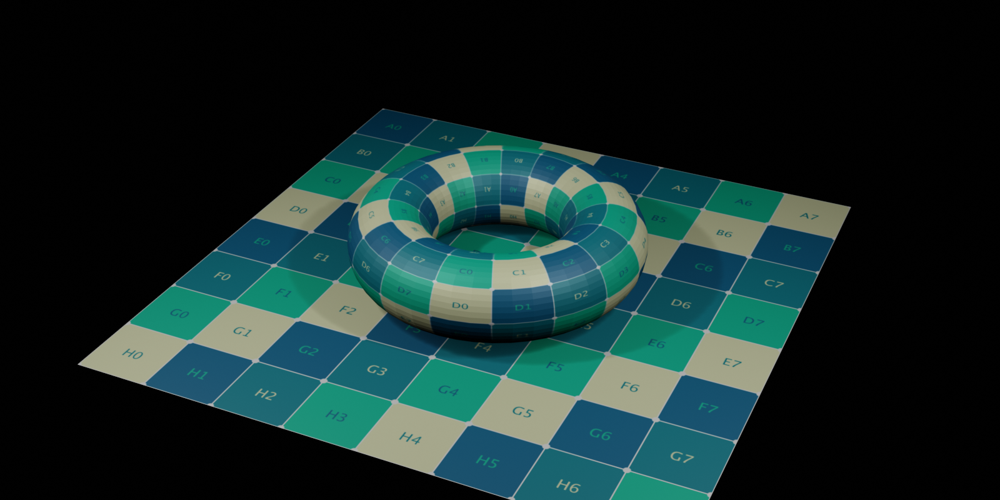

# Script Grid Image


*Rendered image with Blender 2.8(EEVEE)*

## Introduction
For gaming and CG prototyping, there are several easy-to-use UV check pattern textures on the Internet.
But they have the following problems.

- It is unclear who made it.
- The license is unclear.
- The resolution is different.
- The image is compressed.

So in this repository, I manage the Processing code that generates test patterns and the generated SVG files.
By using SVG files, You can export the image at any resolution using other apps.
And the license is clear because it is managed on github.
You can use those images freely for making any commercial tutorials or plugins etc.

## Dependency
- [Processing 3.5.3](https://processing.org/)

## Usage

1. Install Processing from [processing.org](https://processing.org/).
1. Open **ScriptGridImage.pde**
1. Modify code and Run
1. You can save SVG file with 'S' key.

## Release

On the release page, the output image is displayed smaller by using the following html tag.

```html

```